<h1 align="center">jd-search</h1>

<p align="center">
🇰🇷 한국 채용공고 전수조사 + 회사 재무 판정 에이전트 스킬<br>
<sub>Claude Code · Codex · Cursor · Gemini CLI</sub>
</p>

<p align="center">
<a href="https://github.com/jckproduct-ai/jd-search/actions/workflows/test.yml"></a>


</p>

---

**이력서 1개 + 집주소 1개를 넣으면, 다닐 수 있는 범위 안의 내 직군 공고를 전부 모아 각 회사의 재무 위험도까지 붙여 리포트 한 장으로 만듭니다.**

공고를 모아 주는 서비스는 이미 많습니다. 이 스킬이 다른 지점은 두 가지입니다.

- **공고에 회사의 재무 사실을 붙입니다.** "매출 168억"에서 끝나지 않고, 자본잠식·연속 적자를 등급으로 판정하고 그 회사에 물어볼 면접 질문을 만듭니다
- **재무제표만 보지 않습니다.** 재무제표는 작년 이야기라, 올해 들어온 돈이 안 보입니다. **최신 재무제표 + DART 조달 공시(유상증자·전환사채)** 를 함께 봅니다 — 자본잠식으로 찍힌 회사가 지난달 유상증자를 받았으면 상황이 다릅니다
- **범위 밖은 애초에 목록에 없습니다.** 다닐 수 있는 범위를 리포트에 표시만 하는 게 아니라 수집 단계의 필터로 씁니다 (지금은 지역 조건 기준. 통근 시간 실측은 미구현)

> **궁합 점수는 만들지 않습니다.** "이 공고가 당신과 87% 맞습니다" 같은 숫자는 검증할 수 없습니다.
> 이력서는 **검색 키워드를 만드는 재료**로만 씁니다.

---

## 결과물

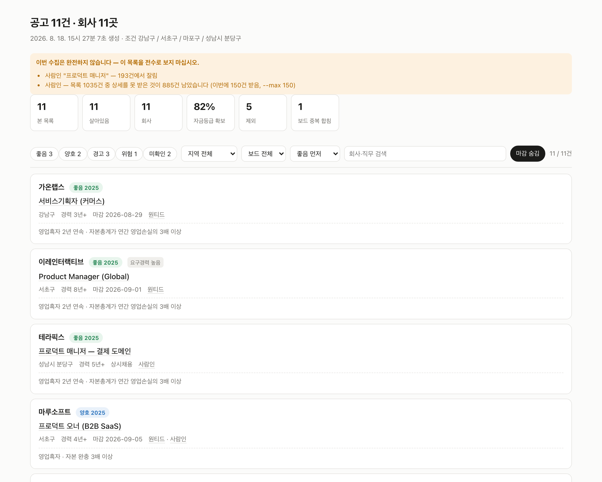

공고마다 **자금등급 · 판정 근거 · 기준연도**가 붙습니다. 상단 경고가 "이번 수집은 완전하지 않다"고 먼저 말합니다 — 어디서 몇 건이 잘렸는지까지 적습니다.

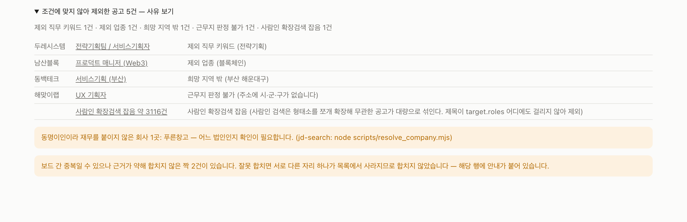

**빠진 것도 전부 보여 줍니다.** 제외한 공고를 회사·직무·사유까지 펼쳐 싣고, 판정하지 못한 것은 판정하지 못했다고 적습니다 — 동명이인이라 재무를 붙이지 않은 회사, 근거가 약해 합치지 않은 중복 후보. 조용히 사라지는 건이 이 도구가 가장 경계하는 실패입니다.

> 두 화면은 **예시 데이터**입니다. 회사명과 숫자는 가공한 것이며, 화면은 실제 렌더러가 그대로 만든 것입니다.
> 실제 회사를 "위험"으로 표시한 화면을 공개 저장소에 싣지 않기 위해서입니다.

---

## 설치부터 첫 리포트까지 — 이대로만 따라오시면 됩니다

처음 한 번만 손이 갑니다. 설정 화면도, 회원가입도 없습니다 — **대화로 묻고 답한 것이 그대로 설정 파일이 됩니다.**
그다음부터는 `새로 올라온 거 있어?` 한 마디면 됩니다.

| | 하는 일 | 걸리는 시간 | 건너뛸 수 있나 |
|---|---|---|---|
| **0** | 준비물 확인 — Node · Claude Code | 2분 | 아니오 |
| **1** | 설치 — 두 줄 | 1분 | 아니오 |
| **2** | 키 1개 발급 | 5분 | **예. 없으면 없는 대로 돕니다** |
| **3** | 첫 대화 — 이력서를 주면 검색 조건을 대신 만듭니다 | 2분 | 아니오 |
| **4** | 위치 — 다닐 수 있는 범위를 정합니다 | 1분 | 아니오 |
| **5** | 첫 실행 — 상한 없이 전부 받습니다 | 20~35분 · **이때만** | 아니오 |
| **6** | 매일 쓰는 화면 — 상태·메모·숨김 | — | — |

---

### 0단계 · 준비물이 있는지부터 봅니다

**딱 두 개만 있으면 됩니다.** 터미널(맥은 `터미널`, 윈도우는 `PowerShell`)을 열고 아래 두 줄을 하나씩 붙여 넣어 보십시오.

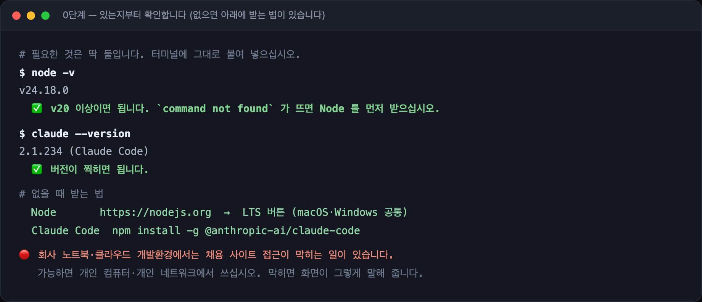

```bash
node -v            # v20.0.0 이상이면 됩니다
claude --version   # 버전이 찍히면 됩니다
```

버전 숫자가 찍히면 그 줄은 통과입니다. `command not found`가 뜨면 아직 없다는 뜻입니다.

| 없을 때 | 받는 법 |
|---|---|
| **Node** | [nodejs.org](https://nodejs.org) 에서 **LTS** 버튼을 눌러 받고 설치합니다 (맥·윈도우 공통). 설치 후 터미널을 **새로 열어야** `node -v`가 잡힙니다 |
| **Claude Code** | 터미널에 `npm install -g @anthropic-ai/claude-code` |

> 🔴 **회사 노트북·클라우드 개발환경에서는 채용 사이트 접근이 막히는 일이 있습니다.**
> 가능하면 개인 컴퓨터·개인 네트워크에서 쓰십시오. 막히면 [화면이 그렇게 말해 줍니다](#막혔을-때--0건이-나오면).

---

### 1단계 · 설치 — 두 줄, 그다음 재시작

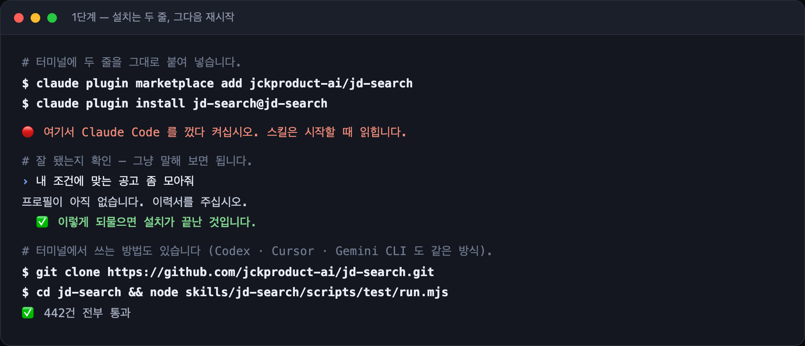

```bash
claude plugin marketplace add jckproduct-ai/jd-search
claude plugin install jd-search@jd-search
```

🔴 **여기서 Claude Code를 껐다 켜십시오.** 스킬은 시작할 때 읽힙니다. 이 재시작을 건너뛰면 다음 단계에서 아무 반응이 없습니다.

**잘 됐는지 확인하는 법** — 명령어를 외울 필요 없습니다. Claude Code 안에서 그냥 말해 보십시오.

```
내 조건에 맞는 공고 좀 모아줘
```

`프로필이 아직 없습니다. 이력서를 주십시오.` 하고 되물으면 설치가 끝난 것입니다.

<details>
<summary>다른 에이전트에서 쓰려면 (Codex · Cursor · Gemini CLI)</summary>

플러그인 규격은 Claude Code 것이지만 **내용물은 그냥 Node 스크립트와 마크다운 문서**입니다. 저장소를 받아서 `skills/jd-search/SKILL.md`를 에이전트에게 읽히면 그대로 동작합니다.

```bash
git clone https://github.com/jckproduct-ai/jd-search.git
cd jd-search
node skills/jd-search/scripts/test/run.mjs   # 잘 받아졌는지 확인 (네트워크 불필요)
```

</details>

---

### 2단계 · 키는 1개, 그것도 없으면 없는 대로 돕니다

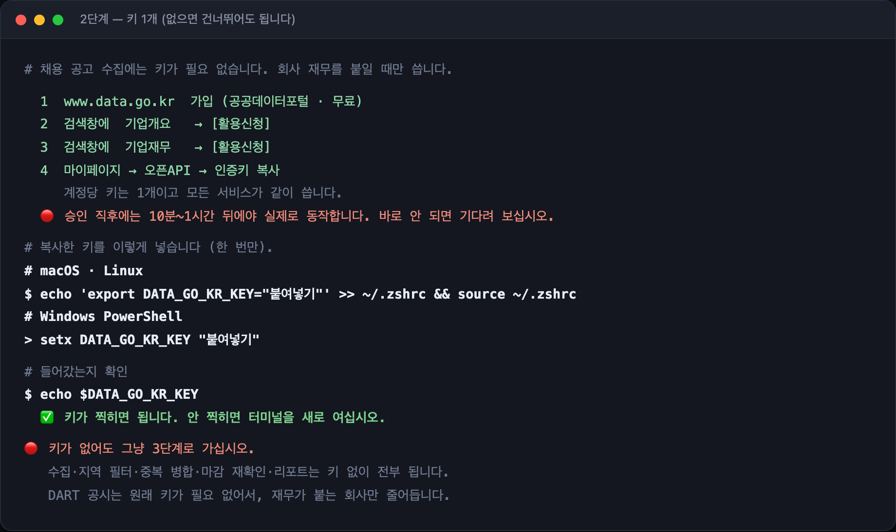

| | |
|---|---|
| 채용 사이트 수집 (원티드·사람인) | **키 불필요** |
| 회사 재무·자금등급 | 공공데이터포털 인증키 **1개** (무료) — DART 공시는 키 없이 조회합니다 |
| 통근 시간 실측 | 카카오 · ODsay (무료, 선택) — 없으면 지역 필터만으로 동작합니다 |
| LLM | **불필요** — 이 스킬을 실행하는 에이전트가 그 역할을 합니다 |

**발급 절차 (5분)**

1. [www.data.go.kr](https://www.data.go.kr) 가입 — 무료입니다
2. 검색창에 **기업개요** 를 넣고 결과에서 `[활용신청]`
3. 검색창에 **기업재무** 를 넣고 결과에서 `[활용신청]`
4. `마이페이지 → 오픈API → 인증키` 복사 — 계정당 키는 1개이고 모든 서비스가 같이 씁니다
5. 복사한 키를 아래처럼 넣습니다 (한 번만)

```bash
# macOS · Linux
echo 'export DATA_GO_KR_KEY="여기에 붙여넣기"' >> ~/.zshrc && source ~/.zshrc
echo $DATA_GO_KR_KEY      # 키가 찍히면 됩니다

# Windows PowerShell
setx DATA_GO_KR_KEY "여기에 붙여넣기"
```

> 🔴 **승인 직후에는 10분~1시간이 지나야 실제로 동작합니다.** 바로 안 되면 잘못한 게 아니라 반영 대기입니다.

**지금 키가 없어도 3단계로 넘어가십시오.** 수집·중복 병합·지역 필터·마감 재확인·리포트는 키 없이 전부 돕니다. 재무가 붙는 회사만 줄어듭니다 — DART 감사보고서 경로는 키 없이도 살아 있습니다.

> 사람인은 공개 검색 페이지를 읽습니다. 오픈API도 있지만 별도 키를 요구해서 쓰지 않습니다 — 필수 키 1개라는 약속이 그만한 값어치가 있다고 봤습니다.

---

### 3단계 · 첫 대화 — 이력서를 주면 검색 조건을 대신 만듭니다

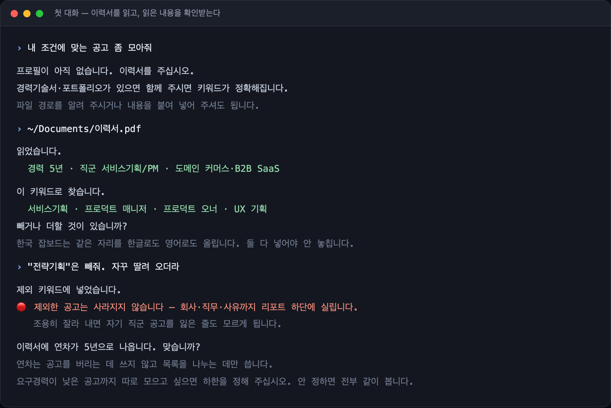

**읽은 내용을 먼저 보여주고 확인을 받습니다.** 뽑은 키워드를 확인 없이 수집에 넣으면 엉뚱한 공고가 그대로 200건 딸려 오고, 그걸 걷어내는 게 처음부터 다시 하는 것보다 오래 걸립니다.

- **이력서가 없어도 됩니다.** [`role-presets.yml`](skills/jd-search/references/role-presets.yml)에서 직군을 고르면 됩니다 — QA·백엔드·프론트엔드·데이터·디자인·마케팅 등이 들어 있습니다. 자기 직군이 없으면 만들어 드리고, [PR로 보내 주셔도 됩니다](CONTRIBUTING.md)
- **한글·영어를 둘 다 넣습니다.** `Product Manager`만 넣으면 `프로덕트 매니저` 공고를 통째로 놓칩니다. 실제로 예시 프로필에 `프로덕트 오너`가 빠져 **PO 공고 17건이 아무 오류 없이 사라진 적**이 있습니다
- **연차는 공고를 버리는 데 쓰지 않습니다.** 목록을 나누는 데만 씁니다 — 신입이든 12년차든 같은 코드가 돕니다
- **제외 키워드로 자른 것도 사라지지 않습니다.** 회사·직무·사유까지 리포트 하단에 실립니다

---

### 4단계 · 위치 — 안 되는 것은 묻는 그 자리에서 말합니다

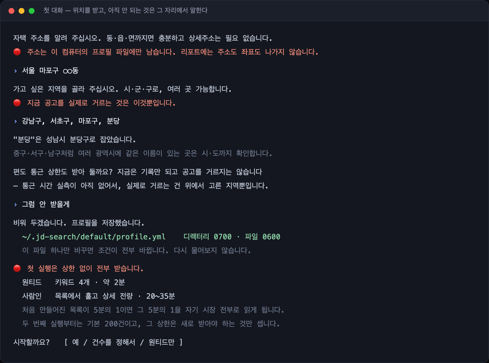

- **자택 주소는 이 컴퓨터를 벗어나지 않습니다.** 프로필 파일에만 남고 리포트에는 주소도 좌표도 나가지 않습니다
- **`분당` 같은 줄임말은 시·군·구로 되물어 확정합니다.** `중구`·`서구`·`남구`처럼 여러 광역시에 같은 이름이 있는 곳은 시·도까지 확인합니다 — 부산 중구가 서울 중구를 찾는 사람 목록에 들어온 적이 있습니다
- **통근 상한은 받아도 거르지 않습니다.** 통근 실측이 아직 없어서 기록만 됩니다. 되는 것처럼 묻지 않고 묻는 자리에서 그렇게 말합니다

> 두 화면은 스킬이 지시하는 대화 순서를 그대로 옮긴 **재현**입니다. 대사는 지어낸 것이 아니라 [`SKILL.md`](skills/jd-search/SKILL.md)의 "첫 실행 — 프로필 만들기"에 적힌 문구이고, 이력서·주소·연차만 가공입니다.
> 실제로는 여러분이 쓰는 에이전트 화면 안에서 같은 순서로 진행됩니다. 생성기는 [`docs/demo/make_onboarding.mjs`](docs/demo/make_onboarding.mjs)입니다.

여기까지가 프로필입니다. `~/.jd-search/<프로필ID>/profile.yml` 한 파일에 전부 들어가고, 다시 묻지 않습니다. 조건을 바꾸고 싶으면 **그 파일을 고치거나 그냥 말로 바꿔 달라고 하면 됩니다.**

---

### 5단계 · 첫 실행 — 이때만 오래 걸립니다

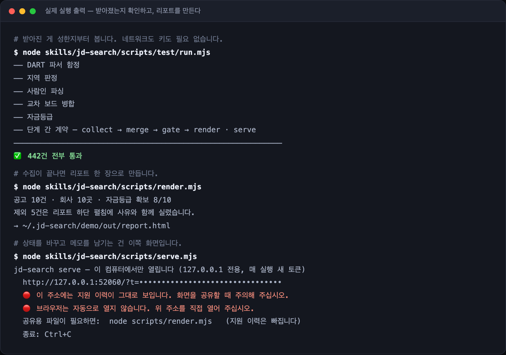

> 이 화면은 재현이 아니라 **실제 실행 출력**입니다. 매번 바뀌는 `serve` 토큰만 가렸습니다.

🔴 **첫 실행은 상한 없이 전부 받습니다.** 사람인 기준 20~35분입니다 — 시작 전에 몇 건을 받는지, 몇 분 걸리는지 알려 드리고 시작합니다.
처음 만들어진 목록이 5분의 1이면 그 5분의 1을 자기 시장 전부로 읽게 되고, 경고 한 줄로는 그 오해를 못 막습니다.
**두 번째 실행부터는 기본 200건**이며, 이 상한은 **새로 받아야 하는 공고만** 셉니다 — 이미 받아 둔 것까지 세면 목록 뒤쪽의 새 공고가 영영 안 받아집니다.

- 중간에 끊겨도 처음부터 다시 돌지 않습니다. 단계마다 결과를 파일로 남기고 이어서 갑니다
- 받아진 게 성한지 의심되면 `node skills/jd-search/scripts/test/run.mjs` — **네트워크도 키도 없이** 회귀 테스트 442건이 돕니다

---

### 6단계 · 매일 쓰는 화면 — 상태·메모·숨김

리포트는 두 가지가 나옵니다. **보관·공유용 파일 하나**와, **실제로 손대는 로컬 화면 하나**입니다.

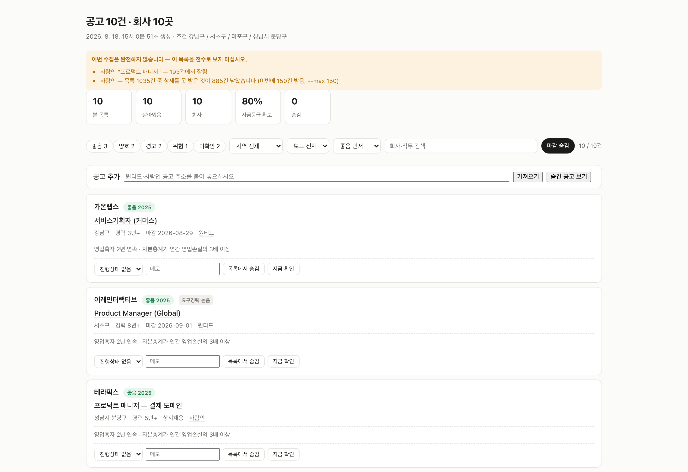

```bash
node skills/jd-search/scripts/serve.mjs
```

지원 상태를 바꾸고, 메모를 달고, 안 볼 공고를 숨기고, 눈에 띈 공고 주소를 붙여 넣어 목록에 넣는 것은 전부 이 화면에서 합니다. **기록은 브라우저가 아니라 파일에 남습니다** — 브라우저를 갈아도 그대로입니다.

이 화면은 이력서·자택주소·지원이력이 있는 디렉터리를 엽니다. 그래서 **`127.0.0.1`에만 열리고, 실행할 때마다 새 토큰을 요구하고, 브라우저를 자동으로 열지 않습니다** ([개인정보](#개인정보)).
남에게 보낼 것이 필요하면 `render.mjs`가 만든 `report.html`을 쓰십시오 — 지원 이력이 빠진 파일입니다.

> 위 화면의 회사명·숫자는 [결과물](#결과물)과 같은 **예시 데이터**입니다. 화면은 실제 `serve`가 그대로 만든 것입니다.

---

## 막혔을 때 — 0건이 나오면

**0건은 "그런 공고가 없다"는 뜻이 아닐 수 있습니다.** 회사망·클라우드·VPN에서 돌리면 채용 사이트 쪽에서 접근을 막습니다.

그래서 이 도구는 0건일 때 그냥 끝내지 않습니다. **무엇이 막혔고 무엇을 하면 되는지**를 콘솔과 리포트에 같은 문장으로 적습니다.

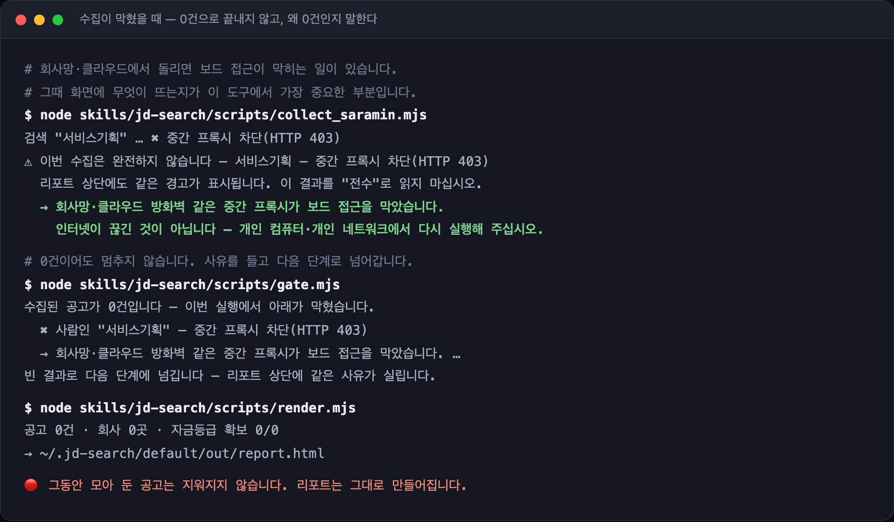

리포트 상단에도 같은 문장이 그대로 실립니다.

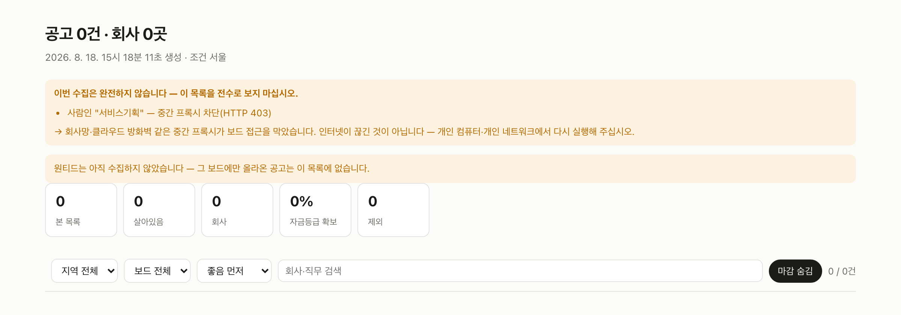

| 화면에 뜨는 말 | 뜻 | 하실 일 |
|---|---|---|
| `중간 프록시 차단(HTTP 403)` | 회사망·클라우드 방화벽이 막았습니다 | **인터넷이 끊긴 게 아닙니다.** 개인 컴퓨터·개인 네트워크에서 다시 실행하십시오 |
| `접근 차단(HTTP 403)` | 보드가 이 컴퓨터의 접근을 거부했습니다 | 브라우저에서 같은 주소가 열리는지 확인하십시오. 클라우드·VPN이면 개인 컴퓨터에서 다시 실행하십시오 |
| `요청 한도 초과(HTTP 429)` | 요청이 너무 잦았습니다 | 10분 이상 두었다가 다시 실행하십시오 |
| `네트워크 연결 실패` | 보드에 연결하지 못했습니다 | 인터넷 연결을 확인하십시오 |
| `주소 없음(HTTP 404)` | 보드가 주소를 바꿨을 수 있습니다 | 스킬을 최신으로 올린 뒤 다시 실행하십시오 |
| 아무 실패도 안 떴는데 0건 | 수집은 정상이었습니다 | 검색 키워드(`target.roles`)나 지역 조건이 너무 좁습니다 |

- **수집이 막혀도 그동안 모아 둔 공고는 지워지지 않습니다.** 리포트는 그대로 만들어지고 상단에 경고만 붙습니다
- **한 보드가 막혀도 나머지 보드는 그대로 돕니다.** 어느 보드가 빠졌는지도 리포트에 적힙니다

---

## 어떻게 동작합니까

```
1 collect   잡보드 → 원시 공고                 ✅ 원티드 · 사람인
2 merge     보드 간 중복 합치기                ✅
3 gate      지역·제외조건으로 컷               ✅  ← 여기서 절반 이상이 걸러집니다
4 alive     마감 재확인 + 재공고 되찾기        ✅ 두 보드 모두
5 finance   회사 → 공시 → 자금등급             ✅
6 commute   상위 후보만 통근 정밀 실측 (선택)  ⏳ 미구현
7 render    report.html                        ✅
  serve     상태 변경 · 추가 · 숨김            ✅ 로컬 전용
```

게이트를 앞에 두는 이유는 뒤 단계의 대상 건수가 절반 이하로 줄어 API 호출과 실행 시간이 같은 비율로 줄기 때문입니다.

**제외된 건수와 사유는 리포트에 항상 표시됩니다.** 조용히 자르지 않습니다.
수집이 부분적으로만 성공했다면(키워드 조회 실패·건수 한도에서 잘림) **리포트 상단에 경고가 뜹니다.** 부분 성공을 전수로 보여주지 않습니다.

각 단계는 JSON in/out이라 따로 돌리고 이어서 돌릴 수 있습니다. 중간에 실패해도 처음부터 다시 돌지 않습니다.

> ⏳ 표시가 붙은 단계는 아직 없습니다. 그래서 지금은 **통근 시간이 필터로 쓰이지 않습니다**(지역 조건만 적용).
> 리포트에도 같은 문구가 실립니다 — 안 되는 것을 되는 것처럼 보여주지 않습니다.

**마감된 자리는 회사 단위로 되짚습니다.** 공고 ID 하나만 보면 같은 자리가 새 ID로 다시 올라온 것을 놓칩니다(실측 6건).
다만 같은 회사의 아무 공고나 끌어오지는 않습니다 — 같은 자리로 이어지거나 내 직군에 걸리는 것만 가져오고, 나머지는 알려만 드립니다.

### 보드가 둘이면 중복이 생깁니다

같은 자리가 원티드와 사람인에 동시에 올라오는 일은 흔합니다. 회사명이 정확히 같고, 제목이 같은 자리로 보이고, 근무지가 겹칠 때만 하나로 합쳐 **출처 링크를 둘 다** 답니다. 한쪽이 먼저 내려가기 때문입니다.

근거가 약하면 **합치지 않고 "중복일 수 있음"으로 표시만** 합니다. 잘못 합치면 서로 다른 자리 하나가 목록에서 조용히 사라지는데, 그건 사용자가 알아챌 방법이 없기 때문입니다. 판정은 `serve`에서 직접 뒤집을 수 있고, 그 결정은 기억됩니다.

### 보드마다 마감 신호가 다릅니다

| | 마감 판정 근거 | 특이점 |
|---|---|---|
| 원티드 | API `status` | 좌표를 그대로 줍니다 |
| 사람인 | 상세의 접수 상태 블록 | 좌표가 없고, **근무지가 여러 곳**일 수 있습니다 |

**날짜가 지났다는 이유로 마감 처리하지 않습니다.** 사람인 실측 40건 중 9건(22%)이 마감일 자체가 없는 상시채용·채용시 공고였습니다.

---

## 어떤 직군이든, 어떤 연차든 됩니다

이력서를 읽어 검색 키워드를 만듭니다. QA 이력서면 `QA · 품질보증 · SDET · 테스트 자동화`로, 백엔드면 `백엔드 · 서버 개발 · Backend`로 바뀝니다.

이력서가 없으면 [`role-presets.yml`](skills/jd-search/references/role-presets.yml)에서 직군을 고르면 됩니다. **자기 직군이 없거나 키워드가 부실하면 [PR을 보내 주십시오](CONTRIBUTING.md).** 이 파일이 이 저장소에서 가장 커뮤니티에 열려 있는 부분입니다.

> 한국 잡보드에서 실제로 쓰이는 표기를 넣는 게 중요합니다. `Product Manager`만 넣으면 `프로덕트 매니저` 공고를 통째로 놓칩니다.

**연차는 공고를 버리는 데 쓰지 않습니다.** 목록을 나누는 데만 씁니다. 판정이 전부 "내 연차 대비"라서 신입이든 12년차든 같은 코드가 돕니다.

| 내 연차 | 목록이 이렇게 보입니다 |
|---|---|
| 신입 (`years: 0`) | `경력무관`·`신입` 공고가 그대로 본 목록에. `경력 5년↑`은 `요구경력 높음` 태그로 구분 |
| 미들 (`years: 5`) | 요구경력 5년 이하가 본 목록에. 신입 공고까지 빼고 싶으면 하한을 그때 켭니다 |
| 시니어 (`years: 12`) | 하한을 8쯤 두면 요구경력 8년 미만이 `요구경력 낮음`으로 따로 모입니다 |

> 요구경력 하한(`acceptExperienceFloor`)의 **기본값은 없습니다.** 정하지 않으면 아무것도 나뉘지 않고 전부 한 목록에 뜹니다 — 섣부른 기본값이 신입의 목록을 통째로 "따로 모음"으로 밀어내기 때문입니다.

---

## 재무 데이터는 어디까지 나옵니까

표본에 따라 갈립니다. 한 숫자로 말하지 않겠습니다.

| 표본 | 확보율 |
|---|---|
| 표본 98개 회사 (2026-08) | **62.2%** |
| 원티드 수집 30개 회사 — 실제 파이프라인 출력 (2026-08) | **50.0%** |
| 사람인 수집 135개 회사 — 실제 파이프라인 출력, 전국 (2026-08) | **48.9%** |

```
공공데이터포털 기업재무   43.9%
+ DART 감사보고서 원문     +18.3%p
─────────────────────────────────
                          62.2%   (표본 98개 회사)
```

DART **정형 API만 붙이면 2%p밖에 오르지 않습니다.** 구직자가 궁금해하는 회사 대부분(비상장 외감)은 사업보고서가 아니라 감사보고서만 공시하기 때문입니다. 그래서 감사보고서 원문 표를 파싱합니다.

**보드마다 확보율이 다른 이유는 파서가 아니라 올라오는 회사가 다르기 때문입니다.** 사람인 표본에서 미확인 69곳 중 60곳이 **DART 미등록** — 외부감사 대상이 아닌 규모라 공시 의무 자체가 없습니다. 원티드 표본에서는 미확인 15곳 중 4곳이 동명이인이었는데, 사람인 표본에서는 1곳뿐이었습니다.

### 투자 정보 — 재무제표가 못 보는 것

재무제표는 **작년 이야기**입니다. 자본잠식으로 찍힌 회사가 올해 유상증자를 받았으면 상황이 다릅니다.
그래서 DART 공시 목록에서 **조달 사건**을 함께 뽑습니다. 재무를 DART에서 찾은 회사는 이미 받아 둔 목록을 그대로 쓰고, 공공데이터포털만으로 재무가 끝난 회사만 DART 조회가 새로 붙습니다.

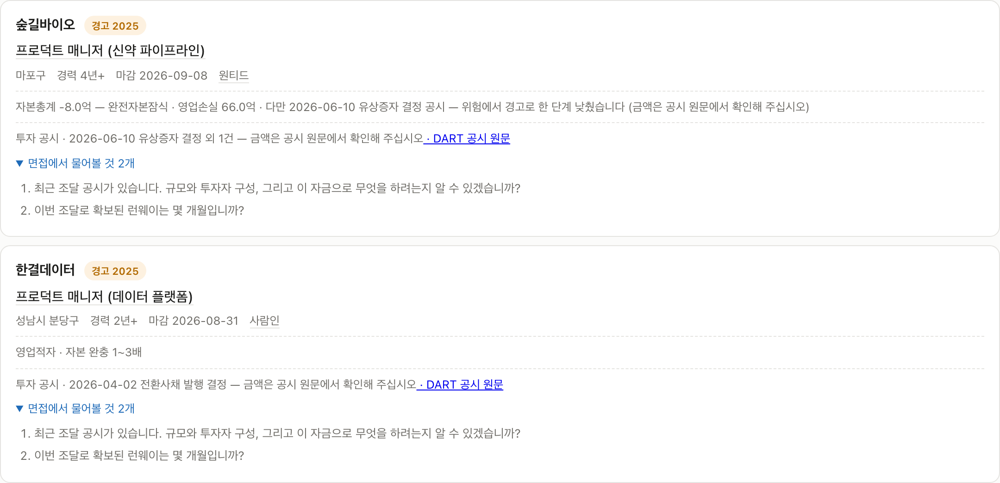

| 세는 것 | 안 세는 것 |
|---|---|
| 유상증자 · 지분증권 증권신고서 · 소액공모 → **지분 조달** | **무상증자** — 잉여금을 자본금으로 옮기는 회계 처리입니다. 돈이 안 들어옵니다 |
| 전환사채 · 신주인수권부사채 · 교환사채 → **부채 조달** | **자기주식 취득 · 주식 소각 · 유상감자** — 돈이 **나갑니다** |
| | **타법인 주식 취득** — 회사가 **남에게** 투자한 것입니다 |
| | **대량보유상황보고** — 기존 주주끼리의 매매입니다 |

🔴 이 구분이 이 기능의 전부입니다. 무상증자를 투자로 세면 회계 처리가 자금 유입으로 둔갑하고, 자기주식 취득을 세면 **돈이 나간 회사가 돈을 받은 회사로 보입니다.**

**등급을 움직이는 경우는 하나뿐입니다.**

| 조건 | 결과 |
|---|---|
| `위험` + 최근 **12개월** 안의 **지분** 조달 | `경고` — **한 단계만** |
| 그 외 전부 | 등급 그대로. 조달 사실만 근거에 싣습니다 |

**금액은 모릅니다.** 공시 제목만 보기 때문입니다 — 원문을 열면 회사당 요청이 한 번 더 늘고, 서식이 제각각이라 금액을 잘못 읽으면 그대로 **잘못된 등급**이 됩니다. 그래서 올리는 폭을 한 단계로 묶고, **"금액은 공시 원문에서 확인해 주십시오"를 문구에서 빼지 않고**, 리포트에 **공시 원문 링크**를 붙입니다. 링크가 곧 근거입니다.

**전환사채는 위험을 내리지 못합니다.** 부채로 들어온 돈이라 자본잠식 판정을 뒤집을 근거가 아닙니다.

**커버리지는 회사에 따라 크게 갈립니다.** 조달 공시는 사업보고서 제출 대상(상장 + 대형 비상장)만 냅니다 — 실측(2026-08-18)에서 비바리퍼블리카 8건, 웹케시 0건, 당근마켓 0건이었습니다. **없는 것을 "투자 없음"으로 적지 않습니다.** 공시가 없으면 아무 말도 하지 않습니다.

끄려면 `profile.yml` 의 `finance.investment: false` 입니다.

---

확보되지 않은 회사는 **`미확인`으로 두고 추측하지 않습니다.** 대신 **왜 미확인인지**를 적습니다 — DART 미등록인지, 같은 이름의 법인이 여러 곳이라 붙이지 않은 것인지는 전혀 다른 상황입니다. 그리고 그 회사에 물어볼 질문을 만듭니다.

---

## 하지 않는 것

- **자동 지원 · 이력서 자동 제출** — 계정 정지 위험이 사용자에게 옵니다
- **동의 없는 크롤링** — 공개 API가 없는 보드는 열 때마다 물어봅니다
- **LinkedIn 수집** — 기본 비활성입니다. 제재가 개인 계정에 옵니다
- **합격률처럼 보이는 숫자** — 검증할 수 없습니다
- **추측으로 공고 버리기** — 판정이 불확실하면 버리지 않고 "미확인" 탭에 남깁니다

---

## 개인정보

이력서·주소·지원 이력은 **이 컴퓨터를 벗어나지 않습니다.** `~/.jd-search/` 아래에만 저장되며, 디렉터리는 `0700`·파일은 `0600`으로 만들어 같은 컴퓨터의 다른 계정도 읽지 못합니다.

- **자택 주소**는 프로필 파일에 남지만 **리포트에는 주소도 좌표도 나가지 않습니다**
- **지원 이력**은 리포트에 기본으로 포함되지 않습니다. 넣으려면 `render.mjs --with-status`로 명시해야 합니다 — report.html은 공유될 수 있는 파일이기 때문입니다
- **`serve`는 `127.0.0.1`에만 열리고, 실행할 때마다 새 토큰을 요구합니다.** Host·Origin도 검사합니다 — 브라우저에 떠 있는 다른 사이트가 이 서버에 요청을 던질 수 있기 때문입니다. 브라우저를 자동으로 열지도 않습니다
- **"삭제"는 목록에서 숨기는 것**이고 기록과 JD 원문은 남습니다. 같은 자리가 새 ID로 재공고되기 때문에, 지우면 이력이 끊기고 같은 회사에 두 번 지원하게 됩니다

공개 데이터(회사 재무·법인 정보)만 캐시에 남습니다.

---

## 누가 왜 만들었습니까

**서비스기획자가 자기 구직을 위해 만들었습니다.** 개발자가 아닙니다.

그래서 이 저장소에서 가장 값나가는 파일은 코드가 아니라 [`docs/IMPROVEMENTS.md`](docs/IMPROVEMENTS.md)와 [`docs/DEVLOG.md`](docs/DEVLOG.md)입니다. **발견한 것은 고쳤든 아니든 전부 남겨 뒀습니다.** 같은 실수가 다시 들어올 때 "왜 이렇게 돼 있는가"의 근거가 그 목록이기 때문입니다.

거기 적힌 것들은 취미 프로젝트의 버그 목록이 아니라 **직접 겪은 손해**입니다.

- 예시 프로필에 `프로덕트 오너`가 빠져 있어서 **PO 공고 17건이 아무 오류 없이 사라지고 있었습니다**
- 공고의 22%는 **마감일 자체가 없습니다**(상시채용·채용시 마감). 날짜로 판정하면 이만큼이 통째로 죽습니다
- 본문이 이미지뿐인 공고가 흔합니다. 글자 없는 파일을 "내용 있는 기록"으로 세면 **공고가 내려간 뒤 영구 손실**입니다

전부 실제로 목록을 훑다가 나온 것들입니다. 만든 사람이 곧 사용자라서 나온 목록입니다.

> 이 도구가 하는 일은 공고를 많이 보여주는 게 아니라 **틀린 걸 안 보여주는 것**입니다.
> 그래서 판정이 불확실하면 버리지 않고 남기고, 못 한 일은 리포트 위쪽에 적습니다.

---

## 라이선스

AGPL-3.0
